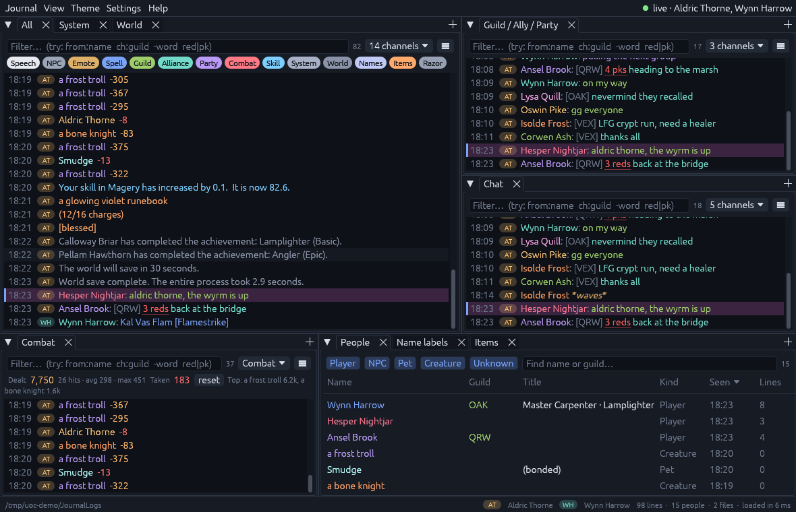
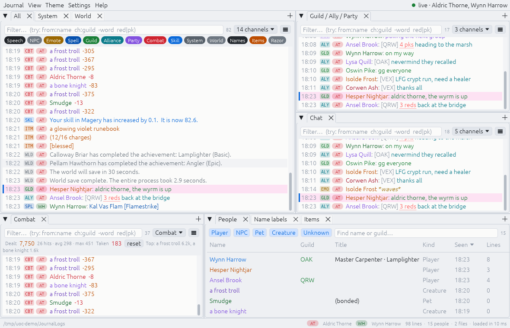

# UOC Journal

A fast, searchable, themeable journal for **ClassicUO**-based Ultima Online
clients (Outlands and other shards), built in Rust for **Linux**.

It follows the journal files the client writes and sorts every line into a
channel. Each pane is its own filtered view of those channels, and you can dock
panes side by side.



<details><summary>Daylight theme with channel badges</summary>



</details>

*Screenshots use made-up demo journals.*

## Features

- **Fast.** Loads about 200 MB of journal text per second (a 9 MB, 110k-line
  journal in ~50 ms). The views are virtualised and filters update
  incrementally, so search results come back as you type, even with millions
  of lines loaded. New lines show up within ~40 ms of the client writing them.
- **Channels.** Each line goes into one of 15 channels:

  | Channel | What goes there |
  |---|---|
  | Speech, NPC, Emote, Spell | Overhead speech from players and NPCs, `*emotes*`, power words (`Kal Ort Por [Recall]`) |
  | Guild, Alliance, Party | `[Guild][name]`, `[Alliance][name]`, `[Party][name]` chat |
  | Combat | Damage numbers (`a frost troll: -210`), poison, parries, bandages, creature emotes (`*looks enraged*`) |
  | Skill | Skill gains, `ItemID skillgain`, skill cap increases |
  | System | Personal system messages |
  | World | World saves, other players' achievements, guild prestige, events, staff messages |
  | Names | Name labels: `Lord Fennick Dale`, `[Steward, OAK]`, `Seasoned Angler`, `(bonded)` |
  | Items | `You see: …`, item labels, `[locked down]` |
  | Razor | Razor / assistant messages |
  | Client | Client-side noise (WorldMap loading …) |

- **Multiple panes.** Panes are dockable: drag tabs to split, stack or float
  them. The default layout has All / System / World, Guild-Alliance-Party,
  Chat, Combat, People, Name labels and Items. You can add more from
  View → New pane or the `+` on any tab bar.
- **People pane.** Name-label spam (all-names macros) becomes a table of
  everyone you have seen: player, NPC, pet or creature, plus guild, rank,
  title and when you last saw them. Double-click a name to open a pane with
  their lines.
- **Combat pane.** Shows damage dealt and taken, hit count, average and max
  hit, and your top targets.
- **Quick filtering.** Every pane has a search box and channel toggles. See
  [Search syntax](#search-syntax) below.
- **Multi-client aware.** All journal files that are being written are followed
  at once, and every line is tagged with the character whose client logged it.
  When two of your characters are in the same guild or alliance, each chat
  message shows only once.
- **Mentions.** Lines that mention one of your characters are tinted.
- **Highlights & alerts.** Colour words or whole lines. An *alert* rule flashes
  or marks the window urgent when a match arrives while it is in the
  background. The default rule highlights reds and PKs in guild and alliance
  chat.
- **Themes.** 45 built in. They include Midnight, Daylight, Britannia, Classic UO, High Contrast, and popular editor palettes (Dracula, Solarized, Gruvbox, Monokai, One Dark, Tokyo Night, Catppuccin, Everforest, Rosé Pine, Kanagawa, Nord, …). There are also UO-flavoured themes like Moonglow, Blood Moon, Virtue and Parchment, and retro terminals. A colour editor lets you change every colour. You can also set the font size, pick any installed font from a searchable list (or add font files with Browse…), use monospace, colour each name differently, and import or export themes as TOML.
- **Character chips.** With several clients, each line carries a chip for its character. New characters get initials and a distinct colour automatically. Click a chip in the status bar to change its letters (up to three) or colour.
- **Channels page.** For each channel you can set its text colour, a row background (on by default, with a light tint), and its own regex rules for moving matching lines into it. A test box shows where a pasted line lands.
- Copying, exporting, selecting lines (Shift+click), a context menu on every
  line, and keyboard navigation.

## Install

### Prebuilt (x86_64)

Download `uoc-journal-…-linux-x86_64.tar.gz` from the Releases or Actions
artifacts, then:

```sh
tar xzf uoc-journal-*-linux-x86_64.tar.gz
cd uoc-journal-*-linux-x86_64
./install.sh          # installs to ~/.local/bin and adds a menu entry
```

Or just run `./uoc-journal` from the extracted folder.

### From source

```sh
# Rust: https://rustup.rs
cargo build --release
./target/release/uoc-journal
```

The binary only links against glibc. Everything else is loaded at runtime:
OpenGL 2+ (any Mesa or vendor driver), `libxkbcommon` plus
`libxkbcommon-x11` on X11, or `libwayland-client` on Wayland. Desktop installs
already have these. On a minimal system, an error like `libxkbcommon-x11.so
could not be loaded` means you need `libxkbcommon-x11-0` (Debian/Ubuntu) or
`libxkbcommon-x11` (Fedora/Arch).

The folder picker uses the XDG desktop portal. If your desktop has no portal,
paste the path into the box instead.

## Setup

1. In the client, turn on **saving the journal to file** (ClassicUO options;
   Outlands has the same option). The client then writes
   `Data/Client/JournalLogs/yyyy_MM_dd_HH_mm_ss_journal.txt`, one file per
   session.
2. Start UOC Journal. On first start it searches for `JournalLogs` folders in
   the usual places:
   - native ClassicUO installs in your home, `~/Games`, `~/.local/share`, `/opt`
   - Wine (`~/.wine`, `$WINEPREFIX`)
   - Lutris (`~/Games/*`)
   - Bottles (native and Flatpak)
   - Steam/Proton (`steamapps/compatdata/*/pfx`)

   Pick one, browse, or paste a path.
3. Play. Journal → *Load the whole folder's history* pulls in everything older
   than the default 12-hour window.

### Why read the log files instead of hooking into the client?

The files have everything except hue, and reading them is safe. Hooking into
the client (memory reading, injection, packet sniffing) is what shard
anti-cheat looks for and is against most shards' rules. It would also break
with every client update.

The lost colours are made up for: the client still encodes the message type in
the name column (`System`, `[Guild][…]`, `You see`, …), and the rest is
recovered with heuristics, so lines get *more* useful colours than the
in-game journal. The "several files in a folder" problem is handled too: all
files are read, the newest are followed live, and every line knows which
character it belongs to.

## Search syntax

```text
red pk              all words (substring, case-insensitive)
Red                 an upper-case letter makes that word case-sensitive
"level 3 gate"      exact phrase
red|pk|gank         any of them (also: red OR pk)
-world              exclude
from:quill          by speaker (also @quill, from:"oswin pike")
ch:guild,ally       by channel
char:thorne         lines from that character's client
is:mention is:self is:dup is:incoming
/\d+ reds?/         regular expression
```

Each pane also has a *saved filter* (⋯ menu) that is always applied, a
character selector, and a duplicate toggle.

## Keyboard

| Keys | Action |
|---|---|
| Ctrl+F | focus the active pane's search box |
| Esc | clear search / selection |
| PgUp / PgDn, ↑ / ↓ | scroll the pane under the mouse |
| Home / End | oldest / newest (End resumes following) |
| Click, Shift+Click | select lines |
| Ctrl+C / Ctrl+A | copy selected / select all |
| Ctrl+L | clear (hide current lines; Journal → Un-clear) |
| F5 | reload from disk |
| Ctrl+, | settings |
| Ctrl + / Ctrl − | zoom |
| F1 | help |

## Configuration

Settings live in `~/.config/uocjournal/uoc-journal.toml`, and the dock layout
in `uoc-journal-layout.json` next to it. Both are plain text and safe to edit.
To keep settings next to the program instead (portable mode), put an empty
`portable.txt` beside the binary.

Example of a custom rule and highlight:

```toml
[[rules]]
name = "reveal is combat"
speaker = "System"
pattern = "(?i)you have been revealed"
to = "Combat"

[[highlights]]
pattern = "gate|rez|res me"
color = "#ffd166"
alert = true
channels = ["Guild", "Party"]
```

## Development

```text
crates/core   uoj-core: parsing, classification, store, query language, file watcher (no GUI deps)
crates/app    uoc-journal: egui/eframe GUI (dockable panes, log view, themes, settings)
```

```sh
cargo test --workspace
# classification report for any journal files or folders:
cargo run --release -p uoj-core --example classify -- ~/path/to/JournalLogs --show combat
```
